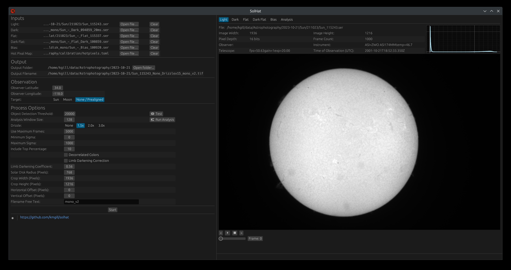
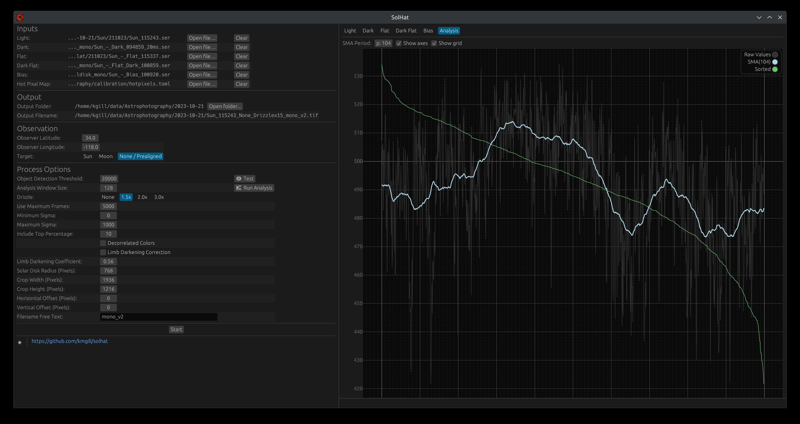

# SolHat UI

This project aims to provide a desktop user interface for the [SolHat](https://github.com/kmgill/solhat) project using Rust and the [egui](https://github.com/emilk/egui) toolkit. 

As a whole, SolHat is a tool for the stacking of solar and lunar astrophotography, aimed primarily at users of azimuth/elevation mounts (though not exclusively) by providing computationally derived parallactic rotation along with center-of-mass alignment. Frame calibration, analysis, limb darkening correction, and drizzle-enabled stacking are among the core functionality.




## Building - Fedora
Install [Rust](rust-lang.org), then execute the following the ensure the correct dependencies are present:
```bash
sudo dnf group install -y "Development Tools"
sudo dnf install -y gtk3-devel
```

## Building - Ubuntu
Install [Rust](rust-lang.org). Most version of Ubuntu, as of this writing, don't seem to support GTK4 yet, with the exception of `22.10` Kinetic Kudu. 
You will need to execute the following to ensure the correct dependencies are present: 
```bash
sudo apt-get update 
sudo apt-get install -y libgtk-3-dev
```

## Building - Windows
To build in Windows (natively, not in Windows Subsystem for Linux), install the latest versions of MS Visual Studio (Community edition is sufficient), and Rust. 